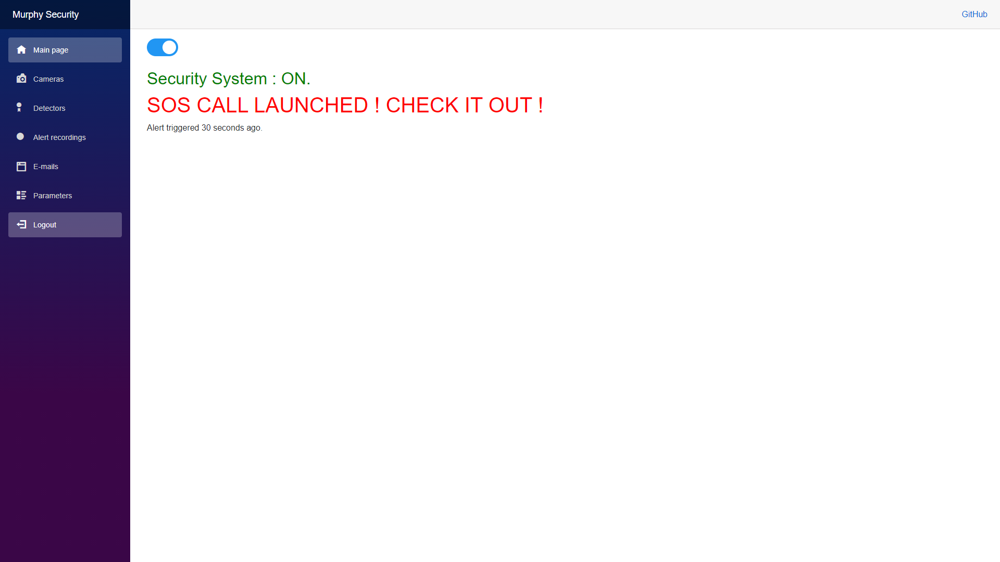

# MurphySecurity (v0.1)
MurphySecurity is a simple home security system designed to be used with Raspberry pi.

## Table of Contents
<ol>
  <li><a href="#about-the-project">About The Project</a></li>
  <li><a href="#features">Features</a></li>
  <li><a href="#pictures-videos">Pictures and Videos</a></li>
  <li><a href="#installation">Installation</a></li>
  <li><a href="#roadmap">Roadmap</a></li>
  <li><a href="#faq">FAQ</a></li>
  <li><a href="#license">License</a></li>
  <li><a href="#contact">Contact</a></li>
</ol>

## About The Project
<p align="center">

</p>
<p>MurphySecurity is a project that was initially started as a small experiment project to combine raspberry pis using python with a .NET CORE 3.1 web application made with Blazor.<br/>The goal was to have it run natively on a raspberry pi while other raspberry pis would be used as cameras using python scripts. Both entities communicate using UDP and TCP sockets on a private WiFi network.</p>
<p>Note that while I plan on making the system compatible with ONVIF IP cameras, I want to keep the possibilty to still have fully custom rpi cameras. So if I ever want to add a lot of image processing (face detection, object recognition, custom functionalities, etc..), I want to be able to do it fully camera side on the rpi camera and only send relevent data to the core. It was the main idea why I initially wanted the cameras to also be raspberry pis instead of just having a core rpi working with ONVIF cameras.</p>
<p>It ended up being a pretty interesting project combining different technical aspects (Blazor, Python, C#, Raspberry Pi/Linux, Networking, Movement detection, 433Mhz detectors, etc..) so I decided to push it to a functional state.<br/>This project can have an interesting educational purpose. If you plan on using it in such a way, please let me know.</p>
<p>The installation process might seem a bit tedious but it is acutally very straight forward.<br/>
I made a script for quick installations but if you're having trouble I also wrote a whole step-by-step guide in order to easily find where the issue is.
</p>

## Features
<p>As of now, MurphySecurity has the following non-exhaustive functionnal features :</p>
<ul>
  <li>One raspberry pi is used as the core application, it can be accessed by ip with any web browser.</li>
  <li>Both core and cameras auto restart in case of crash or power-cut.</li>
  <li>The system doesn't stop working/recording in case of internet failure.</li>
  <li>The system reconnects automatically once internet is back up.</li>
  <li>Easy plug&play once installation is done on the raspberry pis.</li>
  <li>The system has distant login/logout with automatic disconnect after 6 hours.</li>
  <li>Automatically sends an email with the new ip to access core if it has changed.</li>
  <li>Can send alerts to multiple emails.</li>
  <li>Camera recordings can be viewed/deleted from the web app.</li>
  <li>Camera recordings can be downloaded from the web app.</li>
  <li>Camera connection to core if fully automatic.</li>
  <li>Works with raspberry pi night vision cameras.</li>
  <li>The camera detection algorithm is customizable from the web app.</li>
  <li>Compatible with most 433Mhz detectors, alarms or keys. It will both receive signals from detectors/keys and send signals to trigger alarms.</li> 
  <li>3 type of alerts, intrusion alerts from 433Mhz detectors and camera detection, fire alerts from 433Mhz fire detectors, SOS alerts from keys' SOS buttons.</li>
  <li>Alerts are repeated (email sent again) every 3 minutes until dealt with.</li>
  <li>System can easily be turned on or off either from the web app or 433Mhz keys.</li>
  <li>It is very easy to add new 433Mhz devices.</li>
</ul>

## Pictures and Videos

## Installation
<p>Both core and camera installations are assumed to be done on a fresh raspberry pi os install.<br/>
Both should also have the same private WiFi network saved for automated connection.<br/>
MurphySecurity was developped under python 3.7.3, it hasn't been tested with any other python version.<br/>
Do not forget to also forward ports 80 and 443 to the core raspberry pi which should be assigned a static IP.
</p>

### [Core only] 433Mhz receiver/transmitter GPIO connections
<p>If you're installing a core don't forget to set up the GPIO 433Mhz receiver and transmitter using the following indications :<br/>
Open the GPIO Diagram file in the PythonCore folder.<br/>
Connect the 433Mhz receiver and transmitter like this :<br/>
</p>

```
Receiver connections-
Ground : pin 20 (Ground)
+5V : pin 2 (5V power)
Data : pin 18 (GPIO 24)

Transmitter connections-
Ground : pin 6 (Ground)
+5V : pin 4 (5V power)
Data : pin 37 (GPIO 26)
````

### Pi configuration
<p>Open terminal and type :</p>

```
sudo raspi-config
```

<p>Go to "System Options > Hostname" and change "raspberrypi" to "securitycore"/"securitycam" or whatever name you want.</p>
<b>[Camera only]</b>
<p>Then if you're installing a cam also don't forget to enable the camera by going to "Interface Options > Camera" and setting it to "Yes".</p>
<p>Quit and reboot.</p>

### Installation scripts
<p>Download the latest release, unzip, open terminal and run the script of your choice. There are scripts to install and uninstall both core and camera.<br/>
Both can't be on the same pi for now, this will be fixed for the next release.</p>

## [Optionnal] If your camera module looks too "pinkish"
<p>Open :<br/>
sudo nano/boot/config.txt<br/>
Add at the end :<br/>
add awb_auto_is_greyworld=1
</p>

## Roadmap
<ul>
  <li>The things I'm currently working on :
    <ul>
      <li>Make it possible for the same raspberry pi to be both the core and a camera.</li>
      <li>Make the system fully compatible with all ONVIF IP cameras.</li>
      <li>Change the way camera stream is sent to the core to increase quality and lower bandwidth.</li>
    </ul>
  </li>
  <li>A non-exhaustive list of interesting features that could be added :
    <ul>
      <li>Finish implementing another solution than gmail to send emails.</li>
      <li>Being able to switch to 4G/5G network in case of internet failure.</li>
      <li>Add better logging to the C# code.</li>
      <li>Add the possibility for the rpi cameras to detect the 433Mhz signals as well and forward them to the core. That would increase the range for 433Mhz detectors/alarms.</li>
      <li>Add a visitor password to access the core without being able to modifiy its parameters.</li>
      <li>Make the automatic logout purely server side using temporary connection tokens of some sort.</li>
      <li>Add some information on the camera while recording (Date, time, camera ID).</li>
      <li>Implement a solution to add sound to cameras.</li>
    </ul>
  </li>
</ul>

## FAQ
<p><b>My camera looks too pinkish, what can I do ?</b><br/>
This has nothing to do with this project but here is a simple way to somewhat fix it, open:</p>

```
sudo nano/boot/config.txt
```

Add at the end:<br/>

```
awb_auto_is_greyworld=1
```

## License
<p>MurphySecurity is available under AGPL-3.0 License.</p>
<p>Libraries used by MurphySecurity :</p>
<ul>
  <li>opencv-python under the MIT License and all its dependencies, see https://github.com/opencv/opencv-python.</li>
  <li>rpi-rf under the BSD License, see https://github.com/milaq/rpi-rf.</li>
</ul>

## Contact
<p>If you have any question or suggestion feel free to reach out to me at jerem.jlr@gmail.com.</p>
